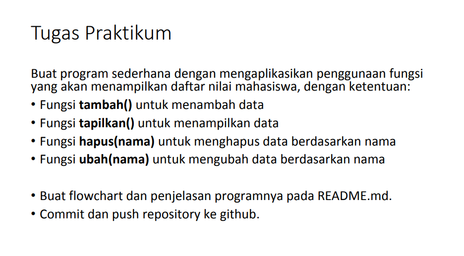
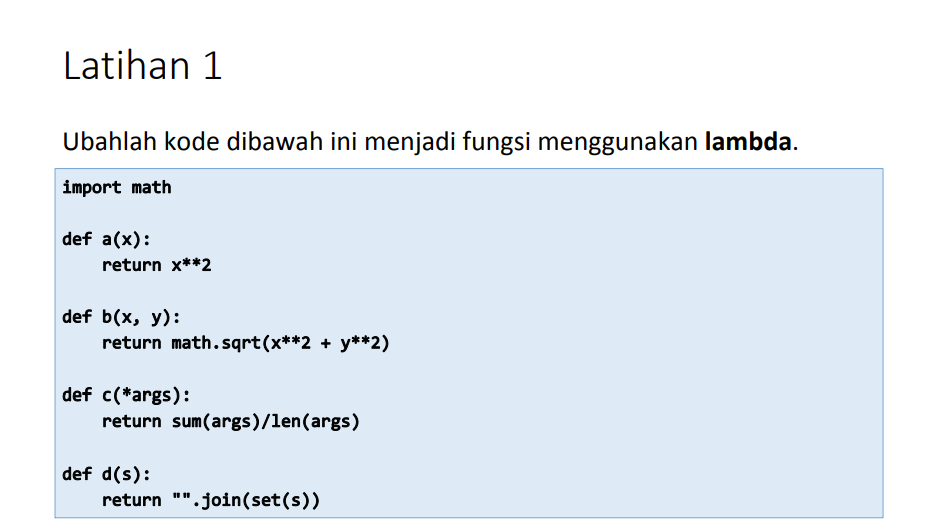
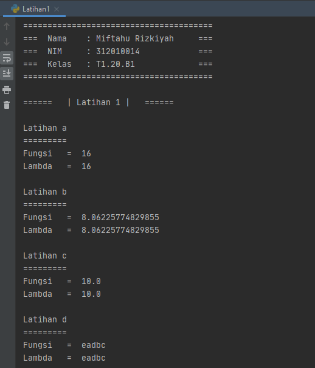

# Pertemuan10_Lab6
Repository ini dibuat untuk memenuhi tugas bahasa pemrograman pada pertemuan ke-10, Lab6

=====***Nama : Miftahu Rizkiyah***=====

========***NIM  : 312010014***========

========***Kelas : TI.20.B.1***========

<br>

Pada Pertuaman ini akan membuat program sederhana dengan mengaplikasikan penggunaan fungsi yang akan menampilkan daftar nilai mahasiswa. seperti dibawah ini :

<br>
<br>
Untuk latihan kali ini adalah merubah dari fungsi ke lambda.<br>
terdapat 4 fungsi didalam lambda,<br>

<br>
<br>
saya akan membahas latihan 1 terlebih dahulu sebelum melanjutkan untuk mengerjakan tugas lab 6 pada pertemuan ke-10 ini.<br>
berikut source code yang saya gunakan untuk fungsi lambda yaitu fungsi tambah : <br>
<br>
```python
import math


def a(x):
    return x ** 2


def b(x, y):
    return math.sqrt(x ** 2 + y ** 2)


def c(*args):
    return sum(args) / len(args)


def d(s):
    return "".join(set(s))


# Dirubah menggunakan Lambda

aa = lambda x: x ** 2
bb = lambda x, y: math.sqrt(x ** 2 + y ** 2)
cc = lambda *args: sum(args) / len(args)
dd = lambda s: "".join(set(s))

# output
print("Latihan a")
print("=========")
print("Fungsi\t = ", (a(4)))
print("Lambda\t = ", (aa(4)))
print()
print("Latihan b")
print("=========")
print("Fungsi\t = ", (b(4, 7)))
print("Lambda\t = ", (bb(4, 7)))
print()
print("Latihan c")
print("=========")
print("Fungsi\t = ", (c(10)))
print("Lambda\t = ", (cc(10)))
print()
print("Latihan d")
print("=========")
print("Fungsi\t = ", (d("abcde")))
print("Lambda\t = ", (dd("abcde")))
```
dari source code latihan tersebut akan menampilkan output sebagai berikut : <br>




